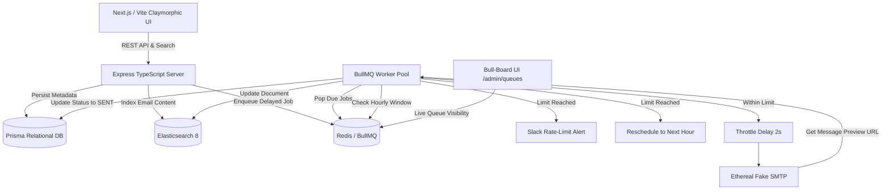

# 🚀 ReachInbox Full-Stack Email Job Scheduler & Dashboard

A production-grade, distributed email scheduling service and modern Claymorphic dashboard built for **ReachInbox.ai (Outbox Labs)**.

---

## 🌟 Key Features Overview

### 🖥️ Backend Architecture
- **Non-Cron Persistent Queue**: Uses **BullMQ + Redis** delayed jobs (`delay = targetTimestamp - Date.now()`). Pure event-driven scheduling with zero cron dependencies.
- **Restart Resilience & Fault Tolerance**: Jobs persist in Redis sorted sets across crashes. On boot, the backend automatically reconciles pending DB records (`reconcilePendingJobsOnBoot`) to guarantee no job loss and idempotency.
- **Configurable Worker Concurrency**: Multi-threaded async worker pool with safe parallel execution (`WORKER_CONCURRENCY=5`).
- **Provider Throttling (Delay Between Sends)**: Configurable minimum delay (e.g., 2 seconds) between consecutive email dispatches.
- **Hourly Rate Limiting & Auto-Rescheduling**:
  - Redis-backed distributed atomic counters per sender/tenant (`ratelimit:sender:{email}:{YYYY-MM-DD-HH}`).
  - When hourly limits are reached, jobs are **not dropped or failed**—they are smoothly rescheduled to the start of the next hour window preserving sequence.
- **Live Slack Alert on Rate-Limit**: Real Slack Incoming Webhook / OAuth integration that instantly sends a rich Block Kit notification when a sender hits their limit.
- **Elasticsearch Fuzzy Search**: Scheduled and sent emails are indexed in Elasticsearch with multi-field fuzzy search (`subject`, `body`, `recipientEmail`, `senderEmail`) with automatic resilient database fallback.
- **Fake SMTP via Ethereal Email**: Supports multiple sender profiles, provisions test inboxes on the fly, and returns live clickable Ethereal preview URLs for every email.
- **Live BullMQ Queue Monitor (Bull-Board)**: Integrated live UI dashboard accessible at `/admin/queues`.

### 🎨 Frontend UI/UX (Claymorphism Design)
- **Claymorphic Visual Language**: Soft 3D extruded surfaces, double drop-shadows with inset highlights, pastel gradients, and tactile click animations.
- **Google OAuth Login + Demo Switcher**: Full authentication flow with profile avatar, name, and email.
- **Scheduled & Sent Emails Dashboard**: Live status badges (`SCHEDULED`, `RESCHEDULED`, `SENDING`, `SENT`, `FAILED`), timestamps, and pagination.
- **Compose Campaign Modal**:
  - Drag-and-drop CSV / Text lead parser (extracts and deduplicates emails on the fly).
  - Schedule date-time picker (future scheduling or immediate send).
  - Throttling delay slider (1s - 15s) and per-sender hourly quota control.
- **Live Ethereal Email Preview Modal**: Click any sent email to view its rendered HTML inside an embedded preview drawer or open directly on Ethereal.
- **Slack Integration Modal**: Connect webhook and dispatch live verification test alerts.

---

## 🏗️ System Architecture



---

## ⚡ Quick Start & How to Run

### Prerequisites
- Node.js 18+ (tested on Node v20/v24)
- npm 9+
- (Optional) Docker for Redis / Elasticsearch / PostgreSQL

### 1️⃣ Clone & Setup Backend

```bash
cd backend
npm install

# Generate Prisma Client & push SQLite/PostgreSQL schema
npx prisma db push

# Seed default senders (Sales, Growth, Founders) and demo accounts
npm run prisma:seed

# Start backend in development mode (with hot-reload)
npm run dev
```

The backend starts at: **`http://localhost:5000`**
- API Base: `http://localhost:5000/api`
- Bull-Board Live Monitor: `http://localhost:5000/admin/queues`

### 2️⃣ Setup & Run Frontend

In a separate terminal:

```bash
cd frontend
npm install

# Start Vite React dev server
npm run dev
```

Open your browser at: **`http://localhost:3000`**

---

## ⚙️ Environment Configuration

### Backend `.env` Options

| Variable | Default | Description |
| :--- | :--- | :--- |
| `PORT` | `5000` | Backend server port |
| `DATABASE_URL` | `"file:./dev.db"` | Prisma connection string (SQLite, PostgreSQL, MySQL) |
| `REDIS_HOST` | `localhost` | Redis host (or empty for auto in-memory mock fallback) |
| `REDIS_PORT` | `6379` | Redis port |
| `WORKER_CONCURRENCY` | `5` | Number of simultaneous email worker jobs |
| `MIN_DELAY_BETWEEN_EMAILS_MS` | `2000` | Minimum throttle delay between email sends (2s) |
| `MAX_EMAILS_PER_HOUR` | `200` | Default global hourly rate limit per sender |
| `ELASTICSEARCH_NODE` | `http://localhost:9200` | Elasticsearch cluster endpoint |
| `SLACK_WEBHOOK_URL` | `""` | Incoming Slack Webhook for rate-limit notifications |

---

## 🛡️ Concurrency, Delay, & Rate Limiting Deep Dive

### 1. Delay Between Emails (Provider Throttling)
- Implemented in `src/queues/email.worker.ts`:
  ```typescript
  const throttleMs = Math.max(config.minDelayBetweenEmailsMs, (job.data.delaySeconds || 2) * 1000);
  await new Promise((resolve) => setTimeout(resolve, throttleMs));
  ```
- Protects against provider spam triggers and mimics human sending cadence.

### 2. Multi-Sender Hourly Rate Limiting
- Keyed per sender and current UTC hour: `ratelimit:sender:{email}:{YYYY-MM-DD-HH}`.
- Handled atomically in Redis with 2-hour TTL expiration.
- If `currentCount >= sender.hourlyLimit`:
  1. The email status in DB is updated to `RESCHEDULED`.
  2. Next hour window date is computed (`getNextHourWindowDate()`).
  3. A rich notification is sent to Slack with sender info, current quota, and reschedule time.
  4. The job is re-enqueued with delay (`rescheduleDelayMs = nextHourStart - Date.now()`) to preserve ordering without dropping.

### 3. Fault Tolerance & Server Restart Survival
- BullMQ stores delayed jobs in Redis Sorted Sets (`zset`), so shutting down or restarting the Node process preserves all timers.
- On startup, `reconcilePendingJobsOnBoot()` verifies the database against Redis to guarantee that any jobs created offline are safely enqueued with zero duplication (`jobId: "email_job_" + email.id`).

---

## 🧪 Testing Checklist & Demo Video Guide

1. **Schedule Emails**:
   - Open `http://localhost:3000`.
   - Click **"Compose New Email"**.
   - Drag & drop `sample-leads.csv` or paste leads.
   - Choose a sender (e.g. `ReachInbox Growth Team`), set 2s delay, and click **Schedule Emails**.
2. **Observe Real-Time Transition**:
   - Watch the **Scheduled Emails** tab update.
   - Within seconds, jobs move to `SENDING` and then `SENT`.
   - Check the **Sent Emails** tab and click **"View Preview"** to inspect the live Ethereal email in the embedded drawer!
3. **Simulate Server Restart**:
   - Schedule emails for 2 minutes in the future.
   - Stop the backend server (`Ctrl+C`) and restart (`npm run dev`).
   - Notice log: `[Resilience] Found pending email jobs... verified & enqueued`.
   - The email sends on schedule without dropping!
4. **Trigger Rate Limit Alert**:
   - Click **"Connect Slack"** in header and enter your webhook URL.
   - Click **"Send Test Slack Alert"** to verify live connection.
   - Schedule a batch with more emails than the sender's hourly limit (e.g. sender limit = 10, batch = 15).
   - Watch the 11th email get tagged as `RESCHEDULED` and check your Slack channel for the live alert!
5. **Live Bull-Board Dashboard**:
   - Visit `http://localhost:5000/admin/queues` to see real-time active, delayed, and completed jobs.

---

## 👥 Submission Details
- **Assignment**: ReachInbox Full-Stack Email Job Scheduler
- **Design System**: Claymorphism (Soft UI 3D)
- **Engine**: TypeScript, Express, BullMQ, Redis, Prisma, Ethereal SMTP, Elasticsearch
